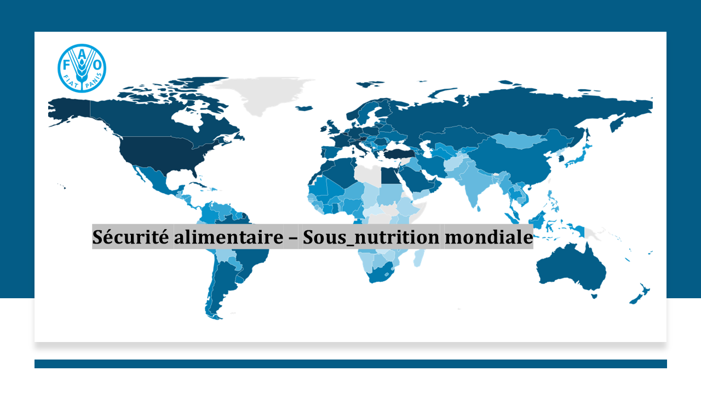
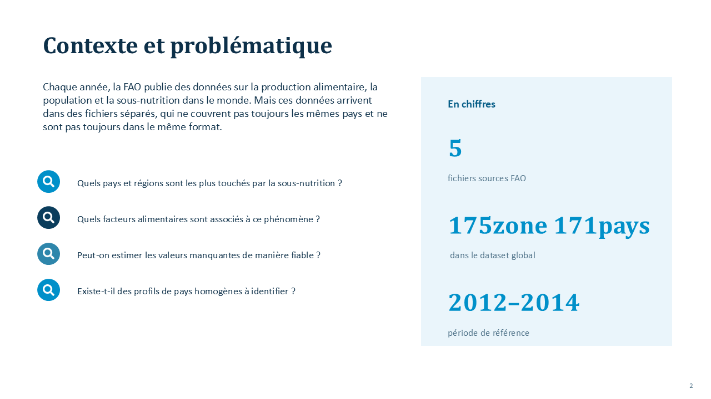
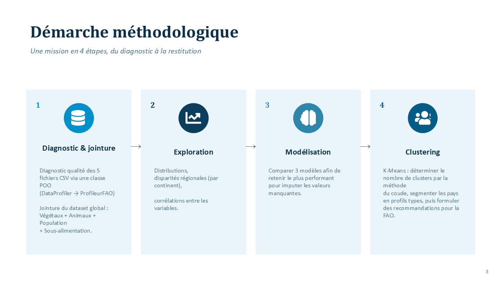

# 🌍 FAO Food Analysis — Sous-nutrition mondiale







## 📂 Structure du projet

-  **`FAO/`** : Fichiers CSV bruts (5 fichiers sources)
-  **`data/`** : Datasets nettoyés et dérivés (dataset global, version imputée)
- **`img/`** : Cartographies exportées (avant/après correction des valeurs négatives)🗺 
-  **`FAO_datalab_analysis.ipynb`** : Étape 1 (J1) — Diagnostic qualité + jointure
- **`FAO_datalab_exploration.ipynb`** : Étape 2 (J2) — Analyse exploratoire
- **`FAO_datalab_modelisation.ipynb`** : Étape 3 (J3) — Régression + ACP
- **`FAO_datalab_clustering.ipynb`** : Étape 4 (J4) — Clustering K-Means + restitution
- **`FAO_profiling_auto.ipynb`** : Complément — Profiling automatisé
- **`EDA_rapport.md`** : Rapport de diagnostic détaillé
- **`rapport_eda_auto.html`** : Profiling automatisé (`ydata-profiling`)

---

## 🌲 Arborescence des fichiers

```text
FAO_food_analysis/
├── 📁 FAO/                            # Fichiers CSV bruts (5 fichiers sources)
├── 📁 data/
│   ├── 📄 dataset_global_fao.csv      # Dataset global nettoyé (Étape 1)
│   └── 📄 dataset_global_fao_impute.csv # Dataset avec Taux_sousnutrition_pct imputé (Étape 3)
├── 📁 img/                             # divers img projet
├── ⚙️ .gitignore                      # Exclut le dossier venv
├── 📝 EDA_rapport.md                  # Rapport de diagnostic — Étape 1 (J1)
├── 📓 FAO_datalab_analysis.ipynb      # Notebook principal — Étape 1 (J1)
├── 📓 FAO_datalab_exploration.ipynb   # Notebook d'analyse exploratoire — Étape 2 (J2)
├── 📓 FAO_datalab_modelisation.ipynb  # Notebook random forest — Étape 3 (J3)
├── 📓 FAO_datalab_clustering.ipynb    # Notebook clustering + restitution — Étape 4 (J4)
├── 📓 FAO_profiling_auto.ipynb        # Complément : profiling automatisé
├── 🌐 rapport_eda_auto.html           # Rapport EDA automatisé (ydata-profiling)
└── 📦 requirements.txt                # Dépendances du projet   
└── 📦 FAO_datalab_restitution.pptx    # Présentation PPT  
   